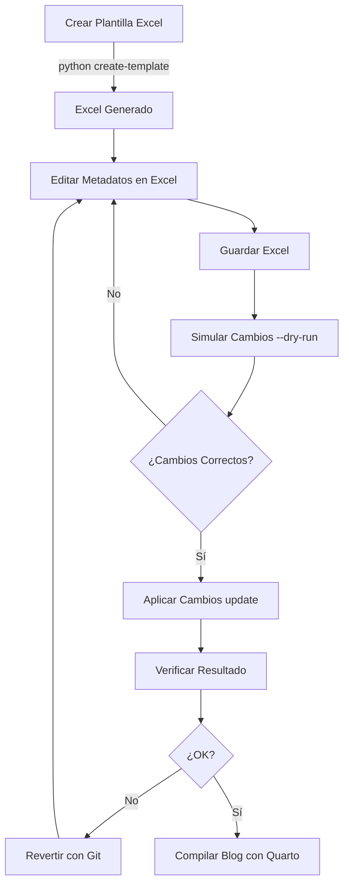

# Sistema de Gestión de Metadatos para Blogs Quarto

**Autor:** Edison Achalma  
**Versión:** 1.0.0  
**Fecha:** Diciembre 2024

## 📋 Descripción

Sistema completo para administrar metadatos de múltiples blogs Quarto desde archivos Excel. Permite gestionar de forma centralizada títulos, autores, tags, categorías, descripciones y todas las opciones de configuración YAML de documentos `.qmd`.

## ✨ Características

- ✅ Gestión centralizada desde Excel
- ✅ Soporte para múltiples blogs simultáneamente
- ✅ Recolección automática de archivos `index.qmd`
- ✅ Actualización selectiva por blog
- ✅ Modo simulación (`--dry-run`) antes de aplicar cambios
- ✅ Soporte completo para 4 tipos de documentos: STU, MAN, JOU, DOC
- ✅ Gestión de múltiples autores y afiliaciones
- ✅ Exclusión automática de carpetas `_site`, `_freeze`, etc.
- ✅ Validación de cambios antes de aplicar
- ✅ Instrucciones integradas en el Excel

## 📦 Requisitos


### 1. Creamos el entorno para el script
```bash
conda create --name script_tag_manager python=3.14
```

### 2. Activamos el entorno
```bash
conda activate script_tag_manager
```

```bash
conda install pandas openpyxl pyyaml 
```

## 🚀 Instalación

1. Descargar el script:
```bash
wget https://github.com/achalmed/scripts_for_quarto/blob/main/script_metadata_manager/quarto_metadata_manager.py
# O copiar el script a tu directorio de trabajo
```

2. Dar permisos de ejecución:
```bash
chmod +x quarto_metadata_manager.py
```

3. Verificar instalación:
```bash
python quarto_metadata_manager.py --help
```

## 📖 Uso

### 1. Crear Plantilla Excel

#### Para todos los blogs:
```bash
python quarto_metadata_manager.py create-template ~/Documents/publicaciones
```

#### Para un blog específico:
```bash
python quarto_metadata_manager.py create-template ~/Documents/publicaciones --blog axiomata
```

#### Con nombre personalizado:
```bash
python quarto_metadata_manager.py create-template ~/Documents/publicaciones -o mis_blogs.xlsx
```

### 2. Editar Metadatos en Excel

1. Abrir el archivo Excel generado
2. Revisar la hoja "INSTRUCCIONES" para guía completa
3. Editar las columnas según necesidad:
   - ✏️ **NO modificar**: `ruta_archivo`, `blog_nombre`, `tipo_documento`
   - ✅ **Editar libremente**: todos los demás campos

### 3. Aplicar Cambios

#### Simular cambios (recomendado primero):
```bash
python quarto_metadata_manager.py update ~/Documents/publicaciones quarto_metadata.xlsx --dry-run
```

#### Aplicar cambios:
```bash
python quarto_metadata_manager.py update ~/Documents/publicaciones quarto_metadata.xlsx
```

#### Actualizar solo un blog:
```bash
python quarto_metadata_manager.py update ~/Documents/publicaciones quarto_metadata.xlsx --blog axiomata
```

## 📊 Estructura del Excel

El Excel generado contiene:

### Hojas por Tipo de Documento

- **STU** - Trabajos estudiantiles
- **MAN** - Manuscritos académicos
- **JOU** - Artículos de revista
- **DOC** - Documentos generales
- **INSTRUCCIONES** - Guía completa de uso

### Columnas Comunes (Obligatorias para todos)

| Campo | Descripción | Formato | Ejemplo |
|-------|-------------|---------|---------|
| `ruta_archivo` | Ruta del archivo (NO EDITAR) | Texto | `axiomata/posts/2024-01-15-articulo/index.qmd` |
| `blog_nombre` | Nombre del blog (NO EDITAR) | Texto | `axiomata` |
| `tipo_documento` | Tipo (NO EDITAR) | STU/MAN/JOU/DOC | `DOC` |
| `title` | Título principal | Texto | `Análisis Económico 2024` |
| `shorttitle` | Título corto | Texto (máx 50 chars) | `Análisis 2024` |
| `subtitle` | Subtítulo | Texto | `Un Estudio Completo` |
| `date` | Fecha publicación | MM/DD/YYYY | `12/19/2025` |
| `draft` | Es borrador | TRUE/FALSE | `FALSE` |
| `abstract` | Resumen académico | Texto (máx 250 palabras) | `Este estudio analiza...` |
| `description` | Descripción breve | Texto | `Análisis económico del año` |
| `keywords` | Palabras clave | Separadas por comas | `economía, análisis, 2024` |
| `tags` | Etiquetas | Separadas por comas | `tutorial, python, datos` |
| `categories` | Categorías | Separadas por comas | `Economía, Análisis` |
| `image` | Imagen destacada | Nombre archivo | `featured.png` |
| `eval` | Evaluar código | TRUE/FALSE | `TRUE` |
| `citation_type` | Tipo citación | article-journal, etc. | `article-journal` |
| `citation_author` | Autor citación | Texto | `Edison Achalma` |
| `citation_pdf_url` | URL del PDF | URL | `https://ejemplo.com/paper.pdf` |
| `links_enabled` | Habilitar enlaces | TRUE/FALSE | `TRUE` |
| `links_data` | Datos enlaces | JSON | `[{"icon":"github","url":"..."}]` |
| `bibliography` | Archivo bib | Nombre archivo | `referencias.bib` |

### Columnas de Autores

Se soportan hasta 3 autores. Para cada autor (N = 1, 2, 3):

| Campo | Descripción | Ejemplo |
|-------|-------------|---------|
| `author_N_name` | Nombre completo | `Edison Achalma` |
| `author_N_corresponding` | Autor correspondiente | `TRUE` (solo uno) |
| `author_N_orcid` | ID ORCID | `0000-0002-XXXX-XXXX` |
| `author_N_email` | Email | `achalmaedison@gmail.com` |
| `author_N_affiliation_name` | Institución | `UNSCH` |
| `author_N_affiliation_department` | Departamento | `Facultad de Economía` |
| `author_N_affiliation_city` | Ciudad | `Ayacucho` |
| `author_N_affiliation_region` | Región | `Ayacucho` |
| `author_N_affiliation_country` | País | `Perú` |
| `author_N_roles` | Roles CRediT | `conceptualization, writing` |

### Columnas Específicas por Tipo

#### STU (Estudiante)
- `course` - Nombre del curso
- `professor` - Nombre del profesor
- `duedate` - Fecha de entrega
- `note` - Nota adicional

#### JOU (Revista)
- `journal` - Nombre de la revista
- `volume` - Volumen y número
- `copyrightnotice` - Año copyright
- `copyrightext` - Texto copyright

#### MAN (Manuscrito)
- `floatsintext` - Figuras en texto (TRUE/FALSE)
- `numbered_lines` - Líneas numeradas (TRUE/FALSE)
- `meta_analysis` - Meta-análisis (TRUE/FALSE)
- `mask` - Enmascarar autores (TRUE/FALSE)

#### DOC (Documento)
- `floatsintext` - Figuras en texto (TRUE/FALSE)
- `numbered_lines` - Líneas numeradas (TRUE/FALSE)

## 🎯 Ejemplos Prácticos

### Ejemplo 1: Crear y Actualizar Blog Individual

```bash
# 1. Crear plantilla solo para blog "axiomata"
python quarto_metadata_manager.py create-template ~/Documents/publicaciones \
    --blog axiomata \
    -o axiomata_metadata.xlsx

# 2. Editar el Excel

# 3. Simular cambios
python quarto_metadata_manager.py update ~/Documents/publicaciones \
    axiomata_metadata.xlsx \
    --blog axiomata \
    --dry-run

# 4. Aplicar cambios
python quarto_metadata_manager.py update ~/Documents/publicaciones \
    axiomata_metadata.xlsx \
    --blog axiomata
```

### Ejemplo 2: Gestión de Múltiples Blogs

```bash
# 1. Crear plantilla para todos los blogs
python quarto_metadata_manager.py create-template ~/Documents/publicaciones \
    -o todos_blogs.xlsx

# 2. Editar en Excel

# 3. Actualizar todos
python quarto_metadata_manager.py update ~/Documents/publicaciones \
    todos_blogs.xlsx
```

### Ejemplo 3: Actualizar Solo Tags y Categorías

En el Excel, editar solo las columnas:
- `tags`: `python, análisis, tutorial`
- `categories`: `Programación, Data Science`

Luego ejecutar:
```bash
python quarto_metadata_manager.py update ~/Documents/publicaciones \
    metadata.xlsx \
    --dry-run  # Verificar cambios primero
```

### Ejemplo 4: Cambiar Estado de Draft

Para publicar múltiples borradores, cambiar en Excel:
- `draft`: `FALSE` (en todas las filas que quieras publicar)

```bash
python quarto_metadata_manager.py update ~/Documents/publicaciones metadata.xlsx
```

## 🔍 Funcionalidades Avanzadas

### Exclusión Automática de Carpetas

El sistema excluye automáticamente:
- `_site/` - Sitio generado
- `_freeze/` - Caché de Quarto
- `site_libs/` - Librerías del sitio
- `.git/` - Control de versiones
- `.quarto/` - Archivos temporales
- `node_modules/` - Dependencias Node
- `__pycache__/` - Caché Python
- `_extensions/` - Extensiones Quarto

### Exclusión de Archivos Especiales

No procesa archivos de estructura:
- `_contenido-inicio.qmd`
- `_contenido-final.qmd`
- `_contenido_posts.qmd`
- `_contenido_*.qmd`
- `404.qmd`
- `contact.qmd`
- `license.qmd`

### Detección Automática de Tipo

El sistema detecta automáticamente el tipo de documento:
1. Por `format.apaquarto-pdf.documentmode` en el YAML
2. Por campos específicos presentes (`course` → STU, `journal` → JOU)
3. Por defecto: DOC

## 📝 Formato de Campos Especiales

### Listas (Keywords, Tags, Categories)

```
# En Excel:
economía, estadística, análisis de datos

# En YAML resultante:
keywords:
  - economía
  - estadística
  - análisis de datos
```

### Booleanos

```
# En Excel (mayúsculas):
TRUE
FALSE

# En YAML resultante:
draft: true
eval: false
```

### Links (JSON)

```
# En Excel:
[{"icon": "github", "name": "Repositorio", "url": "https://github.com/..."}]

# En YAML resultante:
links:
  - icon: github
    name: Repositorio
    url: https://github.com/...
```

### Fechas

Formatos aceptados:
- `12/19/2025`
- `2025-12-19`
- `19-12-2025`

## ⚠️ Precauciones

1. **Hacer backup** antes de actualizar masivamente
2. **Usar --dry-run** primero para ver qué cambiará
3. **No modificar** carpetas `_site`, `_freeze`
4. **Verificar formato** de booleanos (TRUE/FALSE en mayúsculas)
5. **Separar listas** con comas
6. **Guardar como .xlsx** (no .xls ni .csv)

## 🐛 Solución de Problemas

### Error: "Archivo no encontrado"

**Causa:** La ruta en `ruta_archivo` no es válida.

**Solución:**
```bash
# Regenerar la plantilla
python quarto_metadata_manager.py create-template ~/Documents/publicaciones
```

### Error: "No se encontró YAML"

**Causa:** El archivo `index.qmd` no tiene frontmatter válido.

**Solución:** Verificar que el archivo tenga:
```yaml
---
title: "Mi título"
...
---
```

### Cambios no se aplican

**Causa:** Formato incorrecto de valores.

**Solución:**
- Booleanos: usar `TRUE` o `FALSE` (mayúsculas)
- Listas: separar con comas sin espacios extras
- Fechas: usar formato MM/DD/YYYY

### Excel corrupto

**Causa:** Guardar en formato incorrecto.

**Solución:** Guardar siempre como `.xlsx` (Excel 2007+)

## 📂 Estructura de Archivos

```
Documents/publicaciones/
├── axiomata/
│   ├── posts/
│   │   └── 2024-01-15-articulo/
│   │       └── index.qmd          # ✅ Se procesa
│   ├── _site/                      # ❌ Se excluye
│   └── _contenido-inicio.qmd      # ❌ Se excluye
├── actus-mercator/
│   └── ...
└── website-achalma/
    ├── blog/
    │   └── posts/
    │       └── 2024-01-15/
    │           └── index.qmd      # ✅ Se procesa
    └── _site/                     # ❌ Se excluye
```

## 🔄 Flujo de Trabajo Recomendado



## 📞 Soporte

**Autor:** Edison Achalma  
**Email:** achalmaedison@gmail.com  
**Ubicación:** Ayacucho, Perú

### Reportar Problemas

Si encuentras un error:
1. Ejecutar con `--dry-run` para diagnosticar
2. Verificar formato de los datos en Excel
3. Revisar mensajes de error en consola
4. Contactar al autor con detalles

## 📄 Licencia

Este script es de uso libre para gestión personal de blogs académicos.

## 🎓 Casos de Uso

### Academia
- ✅ Gestión de blogs de investigación
- ✅ Publicaciones académicas
- ✅ Portafolios de estudiantes
- ✅ Material de cursos

### Proyectos
- ✅ Documentación técnica
- ✅ Blogs corporativos
- ✅ Sitios de divulgación
- ✅ Archivos personales

## 🚀 Mejoras Futuras

- [ ] Interfaz gráfica (GUI)
- [ ] Validación de ORCID en línea
- [ ] Exportación a otros formatos
- [ ] Sincronización con Google Sheets
- [ ] Historial de cambios
- [ ] Rollback automático

---

**Versión:** 1.0.0  
**Última actualización:** Diciembre 2024
